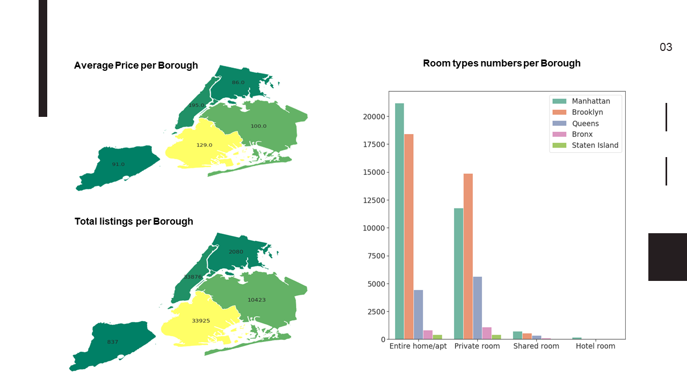
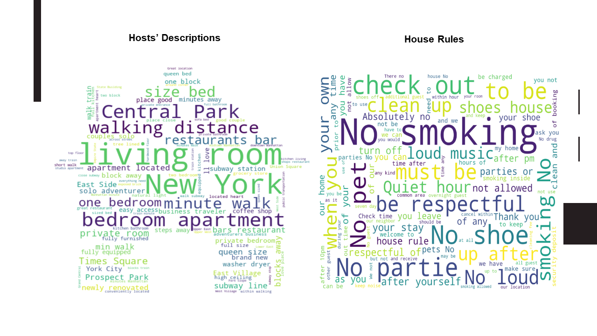
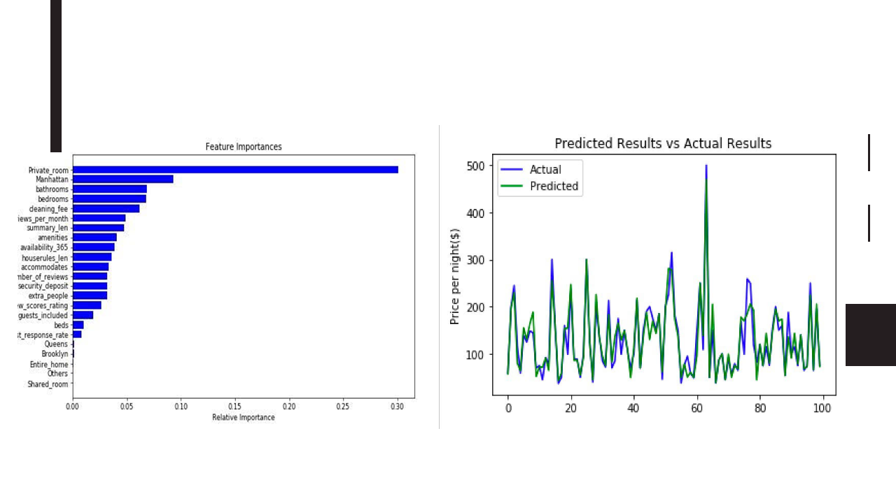

## Airbnb Price Prediction
 

### Problems
 
Airbnb is one of the largest online marketplaces for arranging or offering apartments, homestays 
and lodging. The number of bookings and listings are growing fast, there are over 6 million listings worldwide in 2019. 
New York is listed as one of the top 10 popular cities for booking experiences in the world. The total price of a reservation 
on Airbnb is based on the nightly rate (based price per night), which is sole set by the host, plus other fees such as service fees, 
cleaning fee, etc.

### Datasets
The data used in this project is generated from “Inside Airbnb”, which uses data sourced from publicly available information from the Airbnb site. http://insideairbnb.com/get-the-data.html. The original raw datasets used in this project all stored in the data folder.
### Project purpose
It is important for hosts to understand Airbnb pricing and value the place correctly. This project aims to help hosts to determine a proper nightly rate based on the pricing model built from a range of relative factors in the New York Area
### Python Libraries 
Data cleanning: pandas, numpy 
 
Data Exploratory analysis: matplotlib, seaborn, numpy, geopandas, nltk.sentiment.vader, SentimentIntensityAnalyzer, SelectKBest, WordCloud 
 
Data Model: sklearn.model_selection(train_test_split),sklearn.feature_selection, pandas, sklearn.ensemble(RandomForestRegressor),sklearn.metrics(R^2), matplotlib.pyplot, seaborn, numpy

### Data Exploratory Analysis

 
As we can see from the plots, Mahanttan is the most expensive area and also has highest numbers of listings. Entire home/apt constitudes about 75-80% of listings type. 

 
Wordcloud plots give some key words regarding description, house rules that host can pay attention to while renting the place.

### Model

After running different algorithms including Linear Regression, K Means, Decision Tree, Multiple Regression, we finalize choosing Random Forest Model with highest accuracy ( abt 85%) as our price model.

### Web develop
 
http://aec4.com/cis9650/airbnb.py Hosts can use the link and input their available data. Output will be suggested price housing. 
  
For coding detail, please visit  https://github.com/Janetle-hi/Airbnb-Price-Prediction
