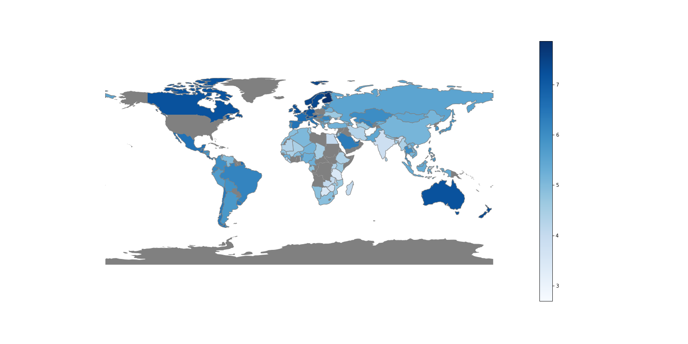
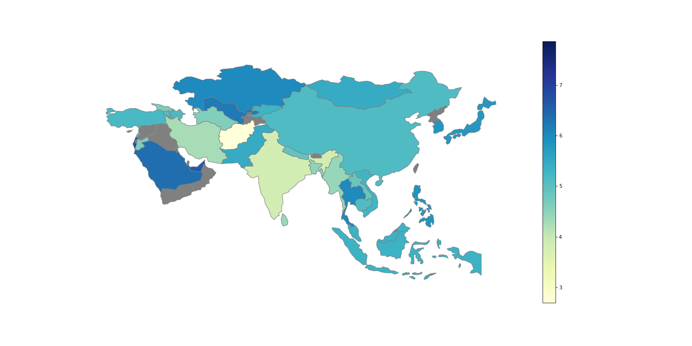
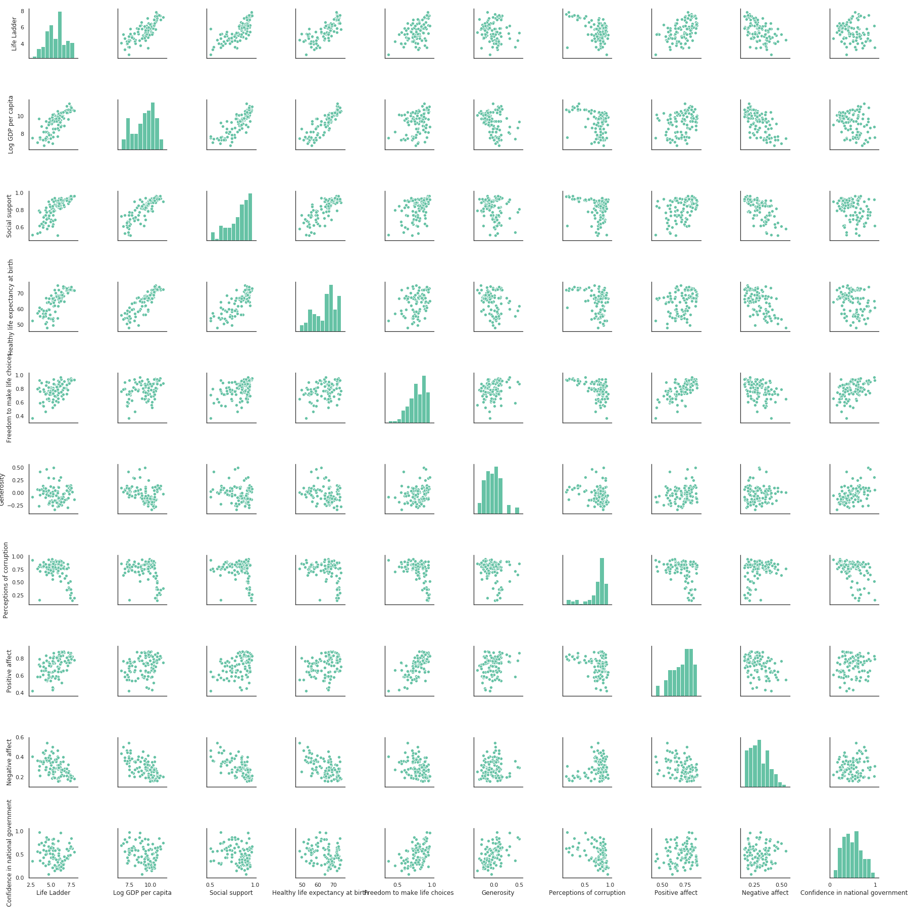
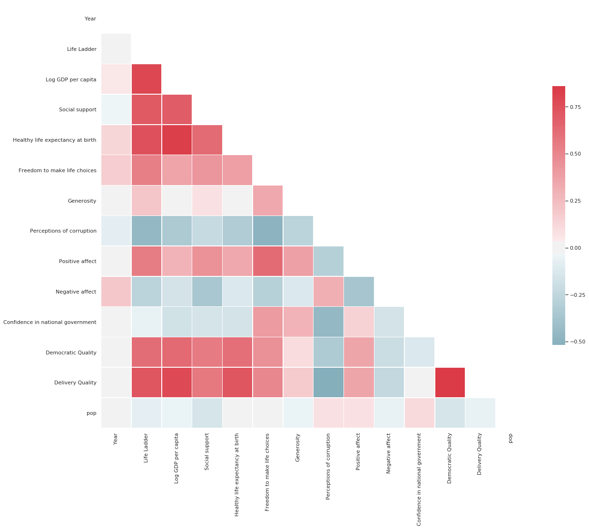
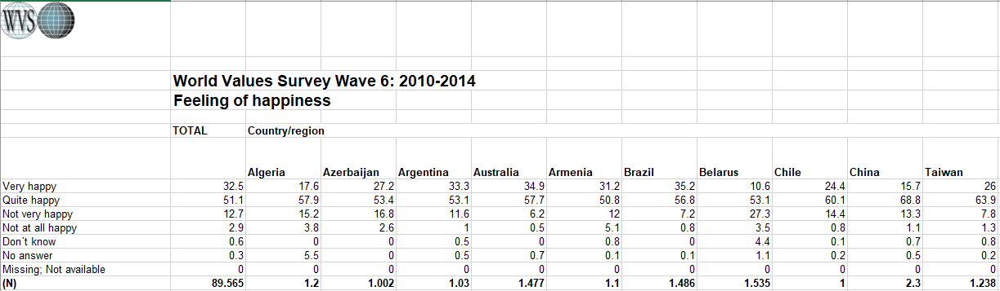
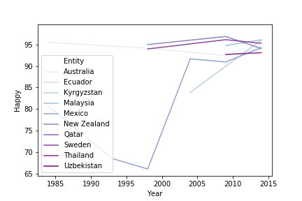

## Happiness and Freedom

### Happiness
#### World Happiness Report
The World Happiness Report is a landmark survey of the state of global happiness that ranks 156 countries by how happy their 
citizens perceive themselves to be. Each year they survey people from more than 150 countries and ask questions about their 
happiness and other aspects in their lives such as social support, freedom, etc. 2019’s World Happiness Report focuses on happiness and the community: how happiness has evolved over the past dozen years, with a focus on the technologies, social norms, conflicts and government policies that have driven those changes.
  
The main life evaluation question asked in the poll is: “Please imagine a ladder, with steps numbered from 0 at the bottom to 10 at the top. The top of the ladder represents the best possible life for you and the bottom of the ladder represents the worst possible life for you. On which step of the ladder would you say you personally feel you stand at this time?” (Also known as the “Cantril Ladder”.)
As with the steps of the ladder, values in the map range from 0 to 10.
Let's first have a general look at whole world's Life Ladder and then take a step closer in Asia. 
 
**World Life Ladder in 2018**

As can be seen, we found that people in North America, Australia, New Zealand, Western Europe are the happiest, followed by Latin America. Meanwhile, the ‘unhappiest’ African country is among the unhappiest ones in the world.
Takeaway: Richer countries tend to have higher average happiness levels; and across time, most countries that have experienced sustained economic growth have seen increasing happiness levels. So the evidence suggests that income and life satisfaction tend to go together.
 
**Asia Life Ladder in 2018**

Northeast Asia has dark blue color scheme. In this sense, China, Japan, Taiwan, Korea are among the happiest countries in Asia.
 
Prior to investigating the relationship between Happiness Score and income, it is always helpful to create a graphical representation to see if there is any correlation. The Seaborn pair plot plots all combinations of two-variable scatter plots in a large grid. I typically feel like this is a bit of information overload, but it can help to spot patterns.

 
The linear regression between Life Ladder and GDP per capita indicates that across time, most countries that have experienced sustained economic growth have seen increasing happiness levels.

  
#### World Value Survey
The World Value Survey (WVS) collects data from a series of representative national surveys covering almost 100 countries, with the earliest estimates dating back to 1981. In these surveys, respondents are asked: “Taking all things together, would you say you are (i) Very happy, (ii) Rather happy, (iii) Not very happy or (iv) Not at all happy”.

The WVS covers only a minority of the world's nations and is only carried out every five years, that's why the data I use latest is 2014 updated. As a result, top 10 countries with highest
The trend throughout the period 1984-2014 is positive that the most recent observation is higher than the earliest and in some cases, the improvement has been very large.

#### Happy Planet Index
The Happy Planet Index measures sustainable wellbeing for all. It tells us how well nations are doing at achieving long, happy, sustainable lives. Wealthy Western countries, often seen as the standard of success, do not rank highly on the Happy Planet Index.  Instead, several countries in Latin America and the Asia Pacific region lead the way by achieving high life expectancy and wellbeing with much smaller Ecological Footprints.In 2016, out of 140 countries, Costa Rica topped the index for the third time in a row. It was followed by Mexico, Colombia, Vanuatu and Vietnam. At the bottom were Chad, Luxembourg and Togo.Below is a snapshot of all countries'scores using Plotly.

_draft_
#### World Database of Happiness
  
### Freedom
In the fact that people tend to immigrate to another country with higher happiness score, in this part, I will investigate freedom in traveling between countries. Freedom score varies in 4 categories: _"Passport Not Required", "Visa Required", "eTA Required", "Visa on Arrial"_, and _*Visa Free*_

 
Below is a snapshot of different countries with information on Happiness Score, Freedom Score, GDP and social support.

