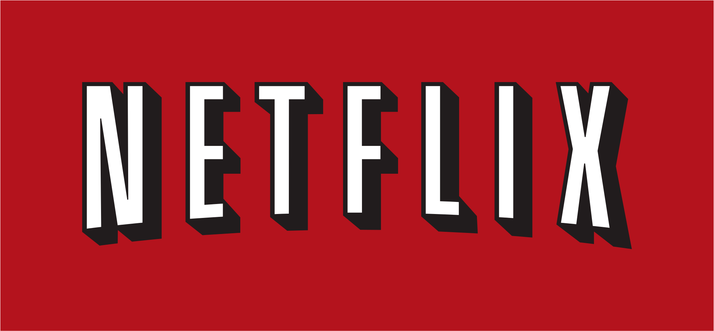
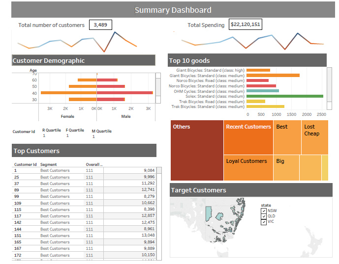

## Portfolio

---

## Project 

#### [Fake news detection](https://github.com/Janetle-hi/Text-Classification/blob/main/Final%20Report.pdf)

As misinformation, rumors or fake news are becoming abundant, this project is motivated by the clash between real news and fake news. How can we minimize the damage and public insecurity caused by its explosive growth? The project is structured around the 2 main research questions:
1. Can we automatically classify a news article as real or fake news?  
2. Can we quickly identify the topic of news through the topwords?. 
 
*Tools: Python, Scikit-Learn, nltk, tf-idf, Text Classification, Topic Modeling, LDA, NER, Logistic Regression, Decision Tree, Random Forest, Naive Bayers, Natural language Processing, KNN*
   
Code: [Jupiter Notebook](https://github.com/Janetle-hi/Text-Classification/blob/main/NLP%20Project_Fake%20and%20real%20news.ipynb) 
 

#### [Movie Recommendation](https://github.com/Janetle-hi/Movie-Recommendation/blob/master/Movie_Recommendation.ipynb)

Shopping online or watching movies is always one of the favourite activities to do for most of us, but most people tend to experience difficult times in finding a good suggestion for their likings and taste. Recommendation system, thus, is introduced as a powerful tool with advanced data leverage techniques on products and customers’ preferences to help in suggesting movie titles and shopping items that can satisfy all. We will apply collaborative filtering techniques in our project to analyse and create a recommendation engine on IMDB datasets from Kaggle.com.    
*Tools: Python, Scikit-Learn, KNN, SVD, content-based system, collaborative filtering system*

#### [Airbnb Price Prediction](/sample.md)

Airbnb is one of the largest online marketplaces for arranging or offering apartments, homestays and lodging. New York is listed as one of the top 10 popular cities for booking experiences in the world.However, there are currently no free and accurate services which help hosts price their properties using a wide range of data points. This project aims to help hosts determine a proper nightly rate based on the pricing model built from a range of relative factors in the New York Area. 
 

*Tools: Python, Scikit-Learn, Feature Scaling, Linear Regression, Logistic Regression, Decision Tree, Random Forest, SVM, Natural language Processing, Web develop*.

---
#### [Customer Churn Prediction](https://github.com/Janetle-hi/Customer-Churn-Prediction/blob/master/Churn%20Modeling.ipynb)

Predicting the probability that a customer will churn or stay has an important role in the implementation of customer retention strategy especially in telecommunications sectors. By predicting user churn, we can take personalized measures and suitable customer service for each user segment.

*Tools: Python, Scikit-Learn, Feature Scaling, Logistic Regression, Decision Tree, Random Forest, SVM, Neural Network*.

---
#### [KPMG Virtual Internship Program - Customer Segmentation](https://drive.google.com/file/d/1vmp2tnGIrvntwETCtVwHIu8ryMAUXRl3/view?usp=sharing)

Perform Cohort Analysis, RFM (Recency, Frequency, Monetary) analysis and K-means Clustering to group customers based on their transaction history for targeting top customers and customized marketing.
  
Code: [Jupiter Notebook](https://github.com/Janetle-hi/RFM-Analysis/blob/master/Customer%20Segmentation.ipynb) 
 
Visualization: [Dashboard](https://public.tableau.com/profile/trang3010#!/vizhome/SprocketCentral_15910466890810/SprocketCentral?publish=yes) 
 
*Tool: Cohort Analysis, RFM model, K-NN, Tableau*

---
#### [Azerbaijani Laundromat](/money.md)

Perform analysis on transaction activities for the years from 2012 to 2014 to detect money laundering activities.

*Tool: Python, SQL, Trifacta, Time Series, Tableau*

---

#### [Happiness and Freedom](/happiness.md)

Essex lorry death tragedy (Oct 2019) has plunged millions of Vietnamese people into sorrow. This made me concerned about the gaps of nations that so many desperate people risk their life for chances at better economic opportunities. But is it the richer, the happier? How significant the gap between the Wealthy and the Poor? In this project, I will explore the data from World Happiness Report and Passport Ranking Index to see what data tells about Happiness & Freedom.

*Tools: Python, seaborn, Plotly*

---
#### [Change Management Project](https://drive.google.com/file/d/1TdC962GKoL4dyyHASkA713mV0fEWIw52/view?usp=sharing) 

 Project Planning covering:   
● Project methodologies (Agile & Waterfall) 
● Essentials of project planning  
● Project scope  
● Scheduling and estimating  
● The critical path  
 
 
Project Plan: Please click [here](https://drive.google.com/file/d/1Ksve6Vo_7OadR9Phlxz8AcvX5yPu1Fpu/view?usp=sharing) to see the Project Plan  
Data Governance Framework: Please click [here](https://drive.google.com/file/d/1Ksve6Vo_7OadR9Phlxz8AcvX5yPu1Fpu/view?usp=sharing).  
Gantt Chart: Please click [here](https://drive.google.com/file/d/1Bjs2JHvZ_1Fpak-0jvDBUFi8BEEPYr9r/view?usp=sharing)

*Topic: Data Quality, Data Governance, Project Management*

## Article
- [E-commerce opportunities in Vietnam](https://www.vietnam-briefing.com/news/e-commerce-logistics-emerging-opportunities-vietnam.html/)
- [Pharmacy Law Guidance Scheduled for July Implementation in Vietnam](https://www.vietnam-briefing.com/news/pharmacy-law-guidance-scheduled-july-implementation-vietnam.html/)

---
