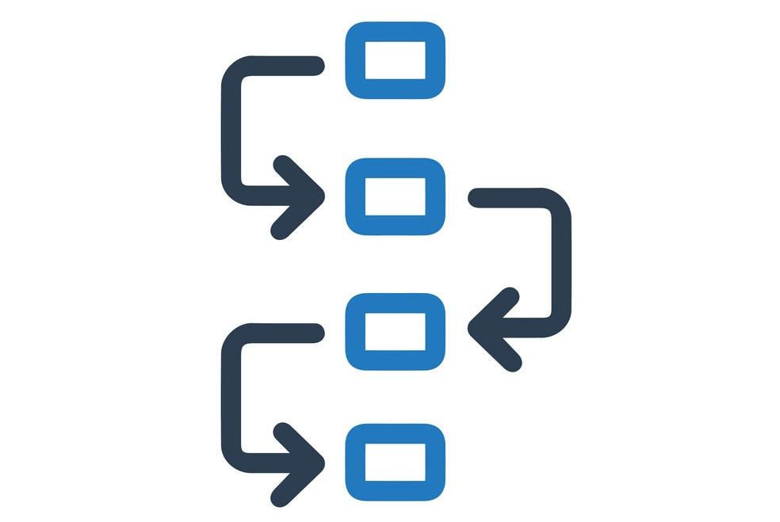

## Portfolio

---

## Project 

#### [Airbnb Price Prediction](/sample.md)

Airbnb is one of the largest online marketplaces for arranging or offering apartments, homestays and lodging. New York is listed as one of the top 10 popular cities for booking experiences in the world.However, there are currently no free and accurate services which help hosts price their properties using a wide range of data points. This project aims to help hosts determine a proper nightly rate based on the pricing model built from a range of relative factors in the New York Area. 
 

*Tools: Python, Scikit-Learn, Feature Scaling, Linear Regression, Logistic Regression, Decision Tree, Random Forest, SVM, Natural language Processing, Web develop*.

---
#### [Customer Churn Prediction](https://github.com/Janetle-hi/Customer-Churn-Prediction)

Predicting the probability that a customer will churn or stay has an important role in the implementation of customer retention strategy especially in telecommunications sectors. By predicting user churn, we can take personalized measures and suitable customer service for each user segment.

*Tools: Python, Scikit-Learn, Feature Scaling, Logistic Regression, Decision Tree, Random Forest, SVM, Neural Network*.

---
#### [Azerbaijani Laundromat](/money.md)

Perform analysis on transaction activities for the years from 2012 to 2014 to detect money laundering activities.

*Tool: Python, SQL, Trifacta, Time Series, Tableau*

---

#### [Happiness and Freedom](/happiness.md)

Essex lorry death tragedy (Oct 2019) has plunged millions of Vietnamese people into sorrow. This made me concerned about the gaps of nations that so many desperate people risk their life for chances at better economic opportunities. But is it the richer, the happier? How significant the gap between the Wealthy and the Poor? In this project, I will explore the data from World Happiness Report and Passport Ranking Index to see what data tells about Happiness & Freedom.

*Tools: Python, seaborn, Plotly*

---
#### [Change Management Project](/plan.md)

A project plan for the implementation of the Collibra Data
Governance application  
● The initial implementation will focus on functionality to support Business Glossary, Data Lineage and Controls
 
 
*Topic: Data Governance, Project Management*

## Article
- [E-commerce opportunities in Vietnam](https://www.vietnam-briefing.com/news/e-commerce-logistics-emerging-opportunities-vietnam.html/)
- [Pharmacy Law Guidance Scheduled for July Implementation in Vietnam](https://www.vietnam-briefing.com/news/pharmacy-law-guidance-scheduled-july-implementation-vietnam.html/)

---
