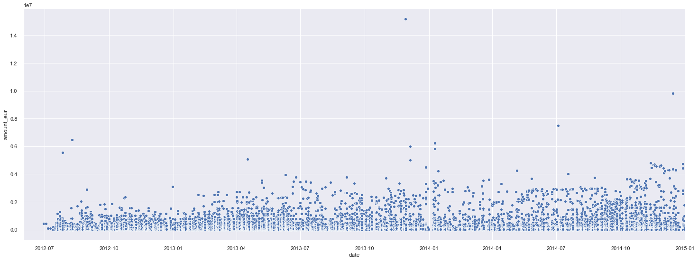

## Money Laundering Analysis
 

 
The Bank records show that there were 16,821 transactions made between 2012 and 2014,  which involved more than $6 billion in total. There is a high possibility that money-laundering operation was conducted by the accounts of four UK-registered firms via Danske’s Estonian branch. 
The four companies are Polux Management LP, Hilux Services LP, Metastar Invest LLP, and LCM Alliance LLP who moved $2.9 billion out of Azerbaijan. They made up over 70% of total transactions and there were unusual activities in the transaction involved in those 4 companies.   
The money reached a wide range of beneficiaries, including family members of high officials in Azerbaijan and Europe. Some transactions with unclear description or recipients. After investigating, we suspect that the money was used illegally for economical and political purpose. (Azerbaijan was ranked 152nd out of  the 180 countries reviewed according to 2018 Corruption Perception Index of Transparency International)  

Slides: Please click [here](https://drive.google.com/open?id=1QZ1p5F7cd5qu3Jk0H7lI1ucROg66eGgz) to see the Project Slides.  
Code: Please click [here](https://github.com/Janetle-hi/Anti-Money-Laundering-Project) to see the Code on Github.
