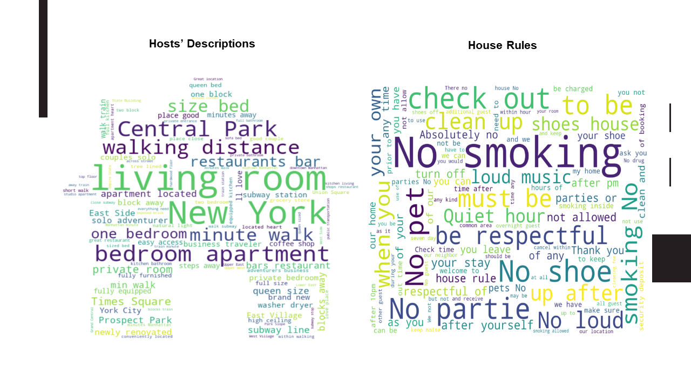

## Airbnb Price Prediction
 

**Problems**
 
Airbnb is one of the largest online marketplaces for arranging or offering apartments, homestays 
and lodging. The number of bookings and listings are growing fast, there are over 6 million listings worldwide in 2019. 
New York is listed as one of the top 10 popular cities for booking experiences in the world. The total price of a reservation 
on Airbnb is based on the nightly rate (based price per night), which is sole set by the host, plus other fees such as service fees, 
cleaning fee, etc.

**Datasets** 
The data used in this project is generated from “Inside Airbnb”, which uses data sourced from publicly available information from the Airbnb site. http://insideairbnb.com/get-the-data.html. The original raw datasets used in this project all stored in the data folder. 
**Project purpose**  
It is important for hosts to understand Airbnb pricing and value the place correctly. This project aims to help hosts to determine a proper nightly rate based on the pricing model built from a range of relative factors in the New York Area  
### Python Libraries  
Data cleanning: pandas, numpy 
 
Data Exploratory analysis: matplotlib, seaborn, numpy, geopandas, nltk.sentiment.vader, SentimentIntensityAnalyzer, SelectKBest, WordCloud 
 
Data Model: sklearn.model_selection(train_test_split),sklearn.feature_selection, pandas, sklearn.ensemble(RandomForestRegressor),sklearn.metrics(R^2), matplotlib.pyplot, seaborn, numpy

### Exploring the Data

We will be using the detailed_listings.csv file which contains detail information about each listing, that we can use to build a machine learning model. The dataset contains 194,937 rows and 106 columns.

We will first look at cross-plots between a sample of variables in the Listings. We can see that many of the variables are well correlated, such as between price and reviews per month, and number of reviews and count of host listings.

### Prepare the data
To be able to build a predictive model, we need to prepare the dataset, by cleaning missing values by removing or imputing them, joining the datasets together, and encoding categorical columns. 
Those steps include: 
- Drop columns that are not relevant to the problem. Example: URL, host picture etc.
- Find missing values for each column.
- Drop columns which have more than 50% missing values. 
- Convert columns to their correct data type. Example: Currency Attributes — Trim $ and , symbols from values and store as integers.
- Subset the dataset based on certain criterion. Ex: property_type = Apartment/House/Townhouse/Condo
- One-hot-encode the categorical variables.

  
After performing data quality assessment by collecting descriptive statistics and patterns, we identify relevant columns for our predictive model.

 
And final data after prifiling and cleansing

### Data Explanatory Analysis

 
As we can see from the plots, Mahanttan is the most expensive area and also has highest numbers of listings. Entire home/apt constitudes about 75-80% of listings type. 

 
Wordcloud plots give some key words regarding description, house rules that host can pay attention to while renting the place.

### Model

After running different algorithms including Linear Regression, K Means, Decision Tree, Multiple Regression, we finalize choosing Random Forest Model with highest accuracy ( abt 85%) as our price model.

### Web develop
 
Hosts can use the link and input their available data. Output will be suggested price housing. 

  

Web: Please click [here](http://aec4.com/cis9650/airbnb.py)  
Code: Please click [here](https://github.com/Janetle-hi/Airbnb-Price-Prediction) to see the Code on Github.
